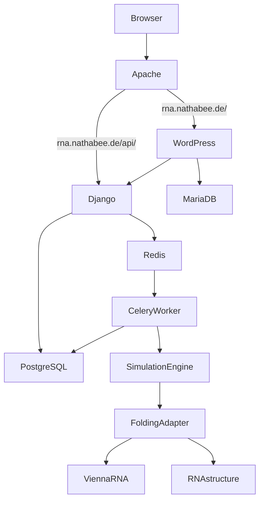

# RNA Bee

Containerized playground for computational RNA folding and evolution experiments.

## Public routing

The project assumes:

* `https://rna.nathabee.de/` -> WordPress
* `https://rna.nathabee.de/api/` -> Django REST API

Apache runs on the VPS host and is intentionally **not** part of this Docker Compose project.

The Docker stack exposes only:

* WordPress -> `127.0.0.1:8080`
* Django -> `127.0.0.1:8000`

PostgreSQL, MariaDB, Redis and Celery have no public host ports.

 

### Clone the repository

Log in with you Docker user and clone the project from GitHub:

```bash
cd ~
git clone https://github.com/nathabee/rna-bee.git
cd rna-bee
```

For later deployments, the repository does not need to be cloned again. Update it with:

```bash
cd ~/rna-bee
git pull
```

## Environment configuration

Create the local environment file:

```bash
cp .env.example .env
nano .env
```

The `.env` file contains local passwords, secrets and deployment configuration and must not be committed to Git.

Validate the Docker Compose configuration:

```bash
docker compose config
```

## Build

Build the project images:

```bash 
# to restart if errors
# docker compose build --no-cache
docker compose build
```

## Start

Start all services:

```bash
docker compose up -d
```

Check their state:

```bash
docker compose ps
```

To inspect logs:

```bash
docker compose logs --tail=100
```

To follow logs continuously:

```bash
docker compose logs -f
```

## Local VPS tests

Before configuring Apache, verify that the Docker services work locally on the VPS.

Test the Django REST API:

```bash
curl http://127.0.0.1:8000/api/health/
```

Expected response:

```json
{"status":"ok","service":"rna-bee-api"}
```

Test WordPress:

```bash
curl -I http://127.0.0.1:8080/
```

Only after these local tests succeed should Apache be configured to expose the project publicly.

## Apache

Apache is shared VPS infrastructure and is not managed by the `rna-bee` Docker Compose stack.

The intended routing is:

```text
https://rna.nathabee.de/
        |
        -> Apache
        -> 127.0.0.1:8080
        -> WordPress

https://rna.nathabee.de/api/
        |
        -> Apache
        -> 127.0.0.1:8000/api/
        -> Django REST API
```

Apache configuration requires a sudo-capable VPS user.

An example configuration is available under:

```text
apache/rna.nathabee.de.conf.example
```

## Docker services

The project currently consists of:

```text
wordpress
wordpress-db
django
celery-worker
postgres
redis
```

### WordPress

WordPress provides the presentation layer and will later contain the user interface for RNA experiments and visualizations.

### MariaDB

MariaDB is dedicated to WordPress.

### Django

Django with Django REST Framework provides the application API.

It will manage:

* experiments
* RNA sequences
* simulation parameters
* experiment status
* results
* users and permissions

### PostgreSQL

PostgreSQL stores the scientific and application data managed by Django.

### Redis

Redis is used as the Celery message broker and can later also be used for caching.

### Celery worker

Celery executes computationally expensive simulations asynchronously instead of blocking Django HTTP requests.

The worker will contain the scientific RNA tooling.

## RNA folding engines

The architecture supports multiple RNA folding engines through a common adapter interface.

The first planned engines are:

* ViennaRNA
* RNAstructure

These libraries will run locally inside the Celery worker Docker image.

They are not remote web services.

The simulation layer will use a common interface so that the same RNA sequence can later be evaluated using different folding engines.

Conceptually:

```text
Simulation Engine
       |
       v
Folding Engine Interface
       |
       +--> ViennaRNA
       |
       +--> RNAstructure
```

## Current skeleton

The initial project skeleton provides:

* Docker Compose infrastructure
* WordPress
* MariaDB
* Django
* Django REST Framework
* PostgreSQL
* Redis
* Celery
* Django health endpoint
* random RNA sequence generator
* point mutation module
* RNA folding engine abstraction
* WordPress plugin skeleton
* Apache reverse-proxy example

ViennaRNA and RNAstructure are intentionally not yet installed.

The first goal is to verify that the complete Docker infrastructure runs correctly on the VPS before adding the scientific dependencies.

## Typical update workflow

After changes have been pushed to GitHub:

```bash
su - beedock
cd ~/rna-bee

git pull
docker compose build
docker compose up -d
docker compose ps
```

If only configuration changed and no image rebuild is required:

```bash
docker compose up -d
```

## Architecture



## License


This project is licensed under the Apache License 2.0.

See the `LICENSE` file for details.
