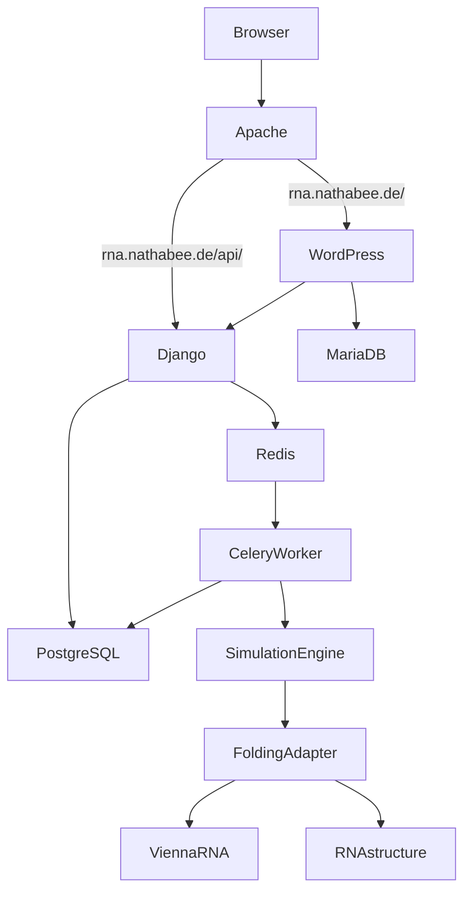

# RNA Bee

Containerized playground for computational RNA folding and evolution experiments.

RNA Bee combines:

* WordPress as the public presentation and interaction layer
* Django REST Framework as the application API
* PostgreSQL for scientific application data
* MariaDB for WordPress
* Redis and Celery for asynchronous simulation jobs
* Docker Compose for reproducible deployment

The WordPress installation is bootstrapped automatically from files stored in this repository, including the RNA Bee child theme, RNA Bee plugin and initial application pages.

---

## Public routing

The project assumes:

* `https://rna.nathabee.de/` → WordPress
* `https://rna.nathabee.de/api/` → Django REST API

Apache runs on the VPS host and is intentionally **not** part of this Docker Compose project.

The Docker stack exposes only:

* WordPress → `127.0.0.1:8110`
* Django → `127.0.0.1:8111`

PostgreSQL, MariaDB, Redis and Celery have no public host ports.

---

## Clone the repository

Log in with the Docker deployment user and clone the project:

```bash
cd ~

git clone git@github.com:nathabee/rna-bee.git

cd rna-bee
```

For later deployments, the repository does not need to be cloned again.

Update it with:

```bash
cd ~/rna-bee

git pull
```

The VPS checkout should be treated as a deployment checkout.

Application changes should normally be made locally, committed and pushed to GitHub, then pulled on the VPS.

---

## Environment configuration

Create the local environment file:

```bash
cp .env.example .env

nano .env
```

The `.env` file contains local passwords, secrets and deployment configuration and must not be committed to Git.

In addition to the database configuration, the WordPress bootstrap requires values such as:

```dotenv
WP_URL=https://rna.nathabee.de
WP_TITLE=RNA Bee

WP_ADMIN_USER=admin
WP_ADMIN_PASSWORD=change-me
WP_ADMIN_EMAIL=admin@example.com
```

Use real secure values in `.env`.

Validate the Docker Compose configuration:

```bash
docker compose config
```

---

## Repository structure

Relevant application directories include:

```text
rna-bee/
├── backend/
├── wordpress/
│   ├── themes/
│   │   └── rna-bee/
│   ├── plugins/
│   │   └── rna-bee/
│   └── bootstrap/
│       └── bootstrap.sh
├── apache/
├── compose.yaml
├── .env.example
└── README.md
```

### WordPress child theme

The RNA Bee child theme is stored under:

```text
wordpress/themes/rna-bee/
```

It is based on Twenty Twenty-Five and contains RNA Bee-specific presentation settings such as:

* color palette
* light/dark mode
* sticky header
* no-title page template
* theme styles
* custom CSS and JavaScript

The theme is bind-mounted into the WordPress container and therefore remains version-controlled independently from the WordPress Docker volume.

### WordPress plugin

The RNA Bee plugin is stored under:

```text
wordpress/plugins/rna-bee/
```

It contains WordPress functionality belonging to the RNA Bee application.

The initial plugin currently provides the frontend skeleton and Django API integration point.

Later functionality can include:

* RNA sequence input blocks
* experiment controls
* Django REST API communication
* simulation status
* folding results
* RNA visualizations

### WordPress bootstrap

The WordPress bootstrap script is stored under:

```text
wordpress/bootstrap/bootstrap.sh
```

It uses WP-CLI to create a reproducible RNA Bee WordPress installation.

The bootstrap currently:

* installs WordPress when necessary
* configures the site title and URL
* configures permalinks
* ensures Twenty Twenty-Five is installed
* activates the RNA Bee child theme
* activates the RNA Bee plugin
* removes default WordPress example content
* creates the initial RNA Bee pages
* configures the static homepage

The script is designed to be idempotent, so running it again should not create duplicate pages.

---

## Build

Build the project images:

```bash
docker compose build
```

For a completely clean image rebuild:

```bash
docker compose build --no-cache
```

This is normally only necessary when debugging image-layer or dependency problems.

---

## First installation

Start the complete Docker stack:

```bash
docker compose up -d
```

Check the service state:

```bash
docker compose ps
```

Wait until the database services report healthy.

Then bootstrap WordPress:

```bash
docker compose run --rm wp-cli /bootstrap/bootstrap.sh
```

The `--rm` option removes only the temporary WP-CLI container after the command finishes.

It does **not** remove WordPress, databases or Docker volumes.

After a successful bootstrap, the WordPress installation should contain:

```text
RNA Bee
├── Home
├── About RNA Bee
└── Explore
```

The following should also be active:

```text
Theme:
RNA Bee

Plugin:
RNA Bee
```

The `Explore` page currently contains the RNA Bee frontend/plugin skeleton.

---

## Verify the WordPress installation

Check the active theme:

```bash
docker compose run --rm wp-cli \
  -c "wp theme list --status=active"
```

Check active plugins:

```bash
docker compose run --rm wp-cli \
  -c "wp plugin list --status=active"
```

The RNA Bee theme files should also be visible inside WordPress:

```bash
docker compose exec wordpress \
  ls -la /var/www/html/wp-content/themes/rna-bee
```

And the plugin:

```bash
docker compose exec wordpress \
  ls -la /var/www/html/wp-content/plugins/rna-bee
```

---

## Normal start

Once WordPress has already been bootstrapped, starting the platform normally requires only:

```bash
docker compose up -d
```

Check:

```bash
docker compose ps
```

---

## When to force-recreate WordPress

If the WordPress service definition, bind mounts or related Compose configuration changes, recreate the WordPress container:

```bash
docker compose up -d --force-recreate wordpress
```

This recreates the container but preserves the `wordpress_data` Docker volume.

It is **not required for every deployment**.

After changing WordPress bootstrap logic, theme files or plugin files, the bootstrap can safely be executed again:

```bash
docker compose run --rm wp-cli /bootstrap/bootstrap.sh
```

---

## Fresh WordPress installation

A clean WordPress test can be performed without deleting the Django/PostgreSQL part of RNA Bee.

First stop and remove only the WordPress containers:

```bash
docker compose stop wordpress wordpress-db

docker compose rm -f wordpress wordpress-db
```

Then remove only the WordPress-related volumes:

```bash
docker volume rm rna-bee_wordpress_data
docker volume rm rna-bee_mariadb_data
```

Do **not** remove:

```text
rna-bee_postgres_data
rna-bee_redis_data
rna-bee_simulation_results
```

Recreate WordPress:

```bash
docker compose up -d wordpress-db wordpress
```

Wait until MariaDB is healthy:

```bash
docker compose ps
```

Then bootstrap the fresh installation:

```bash
docker compose run --rm wp-cli /bootstrap/bootstrap.sh
```

This provides a reproducibility test for the WordPress part of the project.

---

## Local VPS tests

Before configuring Apache, verify that the Docker services work locally on the VPS.

### Django REST API

```bash
curl http://127.0.0.1:8111/api/health/
```

Expected response:

```json
{"status":"ok","service":"rna-bee-api"}
```

### WordPress

```bash
curl -I http://127.0.0.1:8110/
```

Only after these local tests succeed should Apache expose the project publicly.

---

## Logs

Inspect recent logs for all services:

```bash
docker compose logs --tail=100
```

Follow logs continuously:

```bash
docker compose logs -f
```

Inspect a specific service:

```bash
docker compose logs wordpress --tail=100
```

For Django:

```bash
docker compose logs django --tail=100
```

For Celery:

```bash
docker compose logs celery-worker --tail=100
```

---

## Apache

Apache is shared VPS infrastructure and is not managed by the `rna-bee` Docker Compose stack.

The intended routing is:

```text
https://rna.nathabee.de/
        |
        v
      Apache
        |
        v
127.0.0.1:8110
        |
        v
    WordPress


https://rna.nathabee.de/api/
        |
        v
      Apache
        |
        v
127.0.0.1:8111/api/
        |
        v
   Django REST API
```

Apache configuration requires a sudo-capable VPS user.

An example configuration is available under:

```text
apache/
```

Apache remains host infrastructure rather than an application container.

---

## Docker services

The project currently consists of:

```text
wordpress
wordpress-db
wp-cli
django
celery-worker
postgres
redis
```

`wp-cli` is a tool service and does not need to run permanently.

---

## WordPress

WordPress provides the presentation and interaction layer.

The application-specific theme and plugin are stored in Git rather than relying entirely on the persistent WordPress volume.

Conceptually:

```text
Git repository
      |
      +--> wordpress/themes/rna-bee
      |
      +--> wordpress/plugins/rna-bee
      |
      +--> wordpress/bootstrap
                 |
                 v
              WP-CLI
                 |
                 v
        WordPress installation
```

WordPress content belongs in MariaDB, while application presentation and functionality belong in the Git repository.

---

## MariaDB

MariaDB is dedicated to WordPress.

It stores:

* WordPress settings
* pages
* users
* navigation
* runtime CMS data

It is intentionally separate from the scientific application database.

---

## Django

Django with Django REST Framework provides the scientific application API.

It will manage:

* experiments
* RNA sequences
* simulation parameters
* experiment status
* results
* users and permissions

The public API is exposed through:

```text
/api/
```

---

## PostgreSQL

PostgreSQL stores the scientific and application data managed by Django.

Examples include:

* RNA sequences
* experiments
* generations
* mutations
* predicted structures
* calculated properties
* fitness values
* reproducibility metadata

---

## Redis

Redis is used as the Celery message broker and can later also be used for caching.

Redis is private to the Docker backend network and has no public host port.

---

## Celery worker

Celery executes computationally expensive simulations asynchronously instead of blocking Django HTTP requests.

Conceptually:

```text
Browser
   |
   v
Django API
   |
   v
Redis
   |
   v
Celery worker
   |
   v
Simulation engine
   |
   v
Result
```

The worker will contain the scientific RNA tooling.

---

## RNA folding engines

The architecture supports multiple RNA folding engines through a common adapter interface.

The first planned engines are:

* ViennaRNA
* RNAstructure

These libraries will run locally inside the computational environment.

They are not remote web services.

The simulation layer uses a common interface so that the scientific engine is not tightly coupled to one implementation.

Conceptually:

```text
Simulation Engine
       |
       v
Folding Engine Interface
       |
       +--> ViennaRNA Adapter
       |
       +--> RNAstructure Adapter
       |
       +--> future engines
```

---

## Persistent data

Docker containers are disposable.

Persistent data is stored in Docker volumes:

```text
mariadb_data
postgres_data
redis_data
wordpress_data
simulation_results
```

Application code is stored in Git.

The distinction is:

```text
Git
├── application code
├── Django
├── WordPress theme
├── WordPress plugin
├── bootstrap
└── Docker configuration

Docker volumes
├── databases
├── WordPress runtime data
├── uploads
└── simulation results
```

Docker volumes must not be committed to Git.

---

## Current skeleton

The project currently provides:

* Docker Compose infrastructure
* WordPress
* RNA Bee Twenty Twenty-Five child theme
* RNA Bee light/dark frontend mode
* RNA Bee WordPress plugin skeleton
* reproducible WP-CLI WordPress bootstrap
* MariaDB
* Django
* Django REST Framework
* PostgreSQL
* Redis
* Celery
* Django health endpoint
* random RNA sequence generator
* point mutation module
* RNA folding engine abstraction
* Apache reverse-proxy configuration

The platform infrastructure is intentionally developed before progressively adding the scientific simulation functionality.

---

## Typical development workflow

Development happens locally.

```text
Local PC
   |
   v
edit source
   |
   v
git commit
   |
   v
git push
   |
   v
GitHub
   |
   v
VPS git pull
   |
   v
Docker
```

On the VPS:

```bash
su - beedock

cd ~/rna-bee

git pull
```

If backend image contents or dependencies changed:

```bash
docker compose build
docker compose up -d
```

If only Compose configuration changed:

```bash
docker compose up -d
```

If WordPress service mounts changed:

```bash
docker compose up -d --force-recreate wordpress
```

If WordPress bootstrap configuration changed:

```bash
docker compose run --rm wp-cli /bootstrap/bootstrap.sh
```

Finally:

```bash
docker compose ps
```

The VPS working tree should normally remain clean:

```bash
git status
```

Expected:

```text
nothing to commit, working tree clean
```

---

## Architecture



---

## Installation summary

A completely new RNA Bee installation should require approximately:

```bash
git clone git@github.com:nathabee/rna-bee.git

cd rna-bee

cp .env.example .env
nano .env

docker compose config

docker compose build

docker compose up -d

docker compose ps

docker compose run --rm wp-cli /bootstrap/bootstrap.sh
```

Then verify:

```bash
curl http://127.0.0.1:8111/api/health/

curl -I http://127.0.0.1:8110/
```

The goal is that the application can be recreated from:

```text
Git repository
+
.env configuration
+
Docker
```

without depending on manual changes made inside existing containers.

---

## License


This project is licensed under the Apache License 2.0.

See the `LICENSE` file for details.
