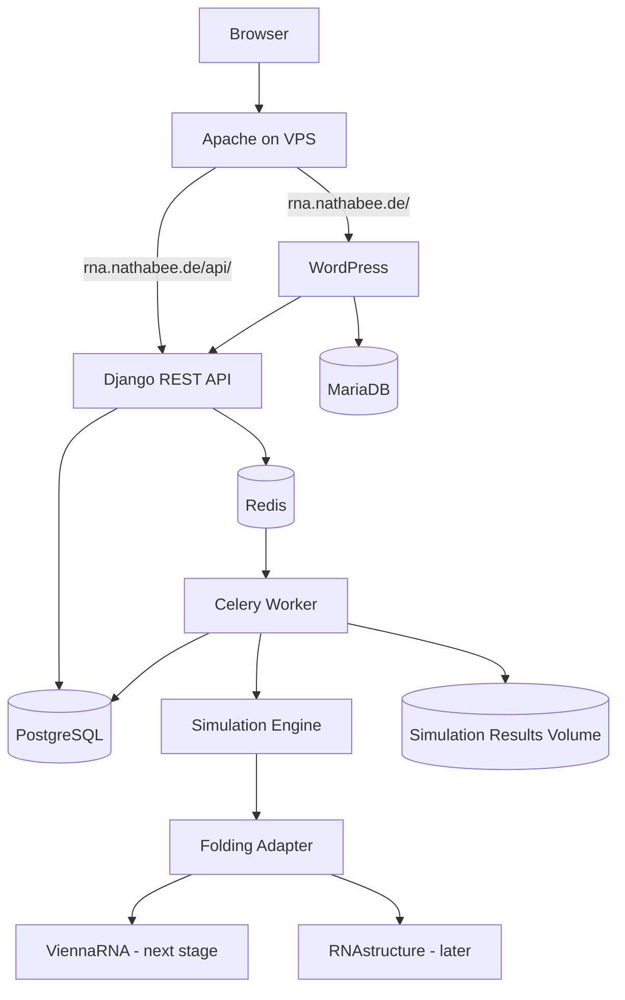

# Architecture

## VPS boundary

Apache is shared infrastructure on the VPS and is not owned by this repository's Docker Compose stack.

The RNA Bee project only owns its Docker services and localhost-bound ports.
